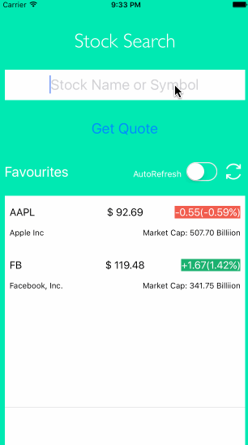
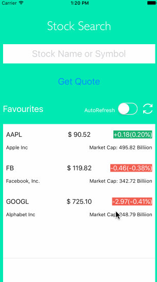
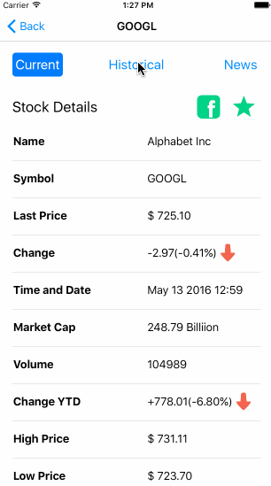

#README
##Overview
This iOS application basically is the app version of the [Stock Search Webpage](https://github.com/JBWKZsf/Stock-Market-Search)
###The website provides the information below:

1.Lastest stock information and trend charts.

2.Historical Stock value chart.

3.Lastest news of the company.

###The things you can do on website:

1.Add the company to the favourtie list.

2.Share the current stock value to facebook.

3.Refresh the stock value of the companies in favourite list. 

##Functionalities Description
* **AutoComplete**

    
  
* **Stock Detail**

  
  
* **Historical Chart**

  