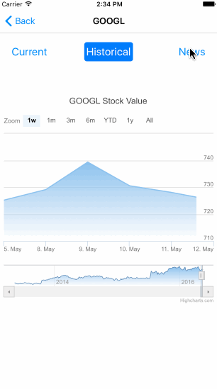

#README
##Overview
This iOS application basically is the app version of the [Stock Search Webpage](https://github.com/JBWKZsf/Stock-Market-Search)
###The app provides the information below:

1.Lastest stock information and trend charts.

2.Historical Stock value chart.

3.Lastest news of the company.

###The things you can do on app:

1.Add the company to the favourtie list.

2.Share the current stock value to facebook.

3.Refresh the stock value of the companies in favourite list. 

##DEMO
* **AutoComplete**

    
  
  - **Functionality**:  
   Type the at least 3 characters and it will provided the potential companies you might want to searh.
  - **Source**:  
    1.Special thanks to [cjcoax](https://github.com/cjcoax) and his [CCAutocomplete](https://github.com/cjcoax/Autocomplete)  
    2.Thanks the company look up API provided by [Market on Demand](https://www.markit.com/product/markit-on-demand)  
  
* **Stock Detail**

  
  
  - **Functionality**:  
   View the stock details in the the table and view the yahoo daily stock chart.
  - **Source**:  
    1.Thanks to stock detail API provided by [Market on Demand](https://www.markit.com/product/markit-on-demand)  
    2.Yahoo daily chart provided by yahoo finance. [Yahoo Finance](http://finance.yahoo.com/)  
    3.[Facebook SDK](https://developers.facebook.com/)
  
* **Historical Chart**

  
  
   - **Functionality**:  
   View the historical stock details in the charts.  
   - **Source**:  
    1.Thanks to stock iteractive chart API provided by [Market on Demand](https://www.markit.com/product/markit-on-demand)  
    2.[Highchart](http://www.highcharts.com/)  
    
   
* **News Feed**  

 
	- **Functionality**:  
	View the news of a specific company.  
	- **Source**:  
	1.Thanks to stock news feed API provided by [Bing News](https://datamarket.azure.com/dataset/bing/search)
	
* **Validation**
  
  
  - **Functionality**:  
	Once the user has provided data and selected a result from the Auto-complete list he would click on ‘Get Quote’, when validation must be done to check that the entered data is valid.
	
* **Favourite List**   

    
  
   - **Functionality**:  
	You can delete the item in the favourite list and refresh the data to the lastest stock detail.